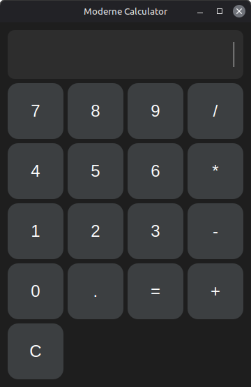

# Modern PyQt6 Calculator

A modern calculator application built with Python and PyQt6 on Linux Mint.

## Features

- Modern dark mode UI
- PyQt6 interface
- Basic calculations
- Stylish buttons
- Responsive layout
- GitHub version control

## Installation

Clone the repository:

```bash
git clone https://github.com/Anakinvisserforyoursnoz/mijn_app.git
cd mijn_app
```

Create a virtual environment:

```bash
python3 -m venv venv
source venv/bin/activate
```

Install dependencies:

```bash
pip install PyQt6
```

## Run the Application

```bash
python3 calculator.py
```

## Screenshot



## Author

Anakinvisserforyoursnoz
